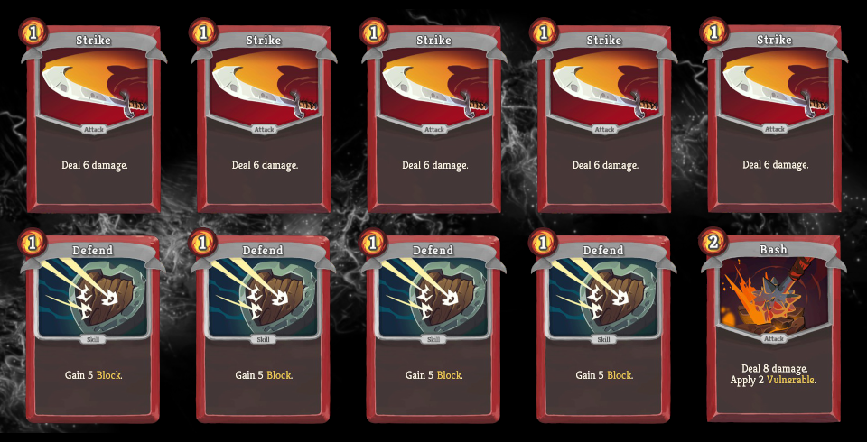
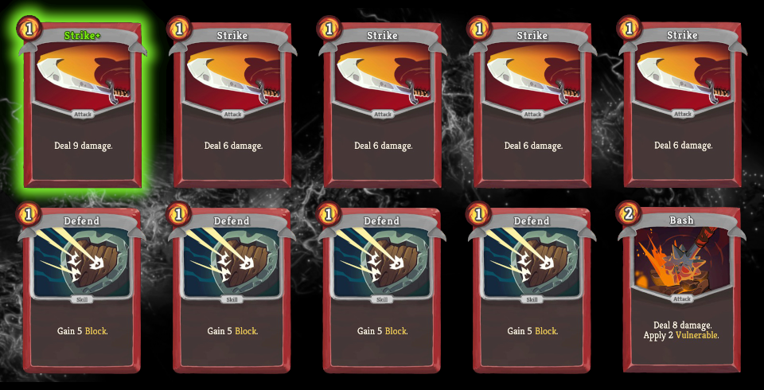
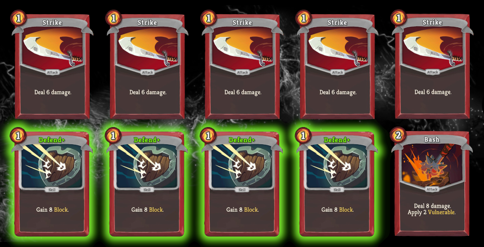

# Quiz #01: Gremlin Nob vs. Ironclad Basic Deck

This is Quiz #01 from the [Slay the Spire Sensei series](/README.md#slay-the-spire-sensei). Try to answer the questions in advance before looking at the [solution](#solution), to get the most out of it. You might also want to check out the corresponding [Reddit thread](https://www.reddit.com/r/slaythespire/comments/cjhgy3/slay_the_spire_sensei_quiz_01_gremlin_nob_vs/). If you have any questions or feedback, drop me a line on [Twitter](https://twitter.com/Dementophobia).

### Environment for the Quiz

To start things off easy, we will keep the setup simple for the first quiz. As [Ironclad](https://slay-the-spire.fandom.com/wiki/Ironclad), you are about to encounter the [Gremlin Nob](https://slay-the-spire.fandom.com/wiki/Gremlin_Nob) with your starting relic ([Burning Blood](https://slay-the-spire.fandom.com/wiki/Burning_Blood)), no potions and your starter deck. You draw 5 cards each turn.

You are at full health (80/80). Your goal is to beat the Gremlin Nob with as little HP loss as possible on average. We assume you are able to play every hand perfectly.

We are running at Ascension 18+, the Gremlin Nob starts with 85 HP. Details about the Ascension 18+ version of the Gremlin Nob can be found in the [Slay the Spire Wiki](https://slay-the-spire.fandom.com/wiki/Gremlin_Nob).

### Question 1

I will give you the opportunity to choose between three upgrades before you start the fight:

**A) Upgrade ONE of your Strikes**

One of your five Strikes will be upgraded to Strike+. Instead of 6 damage this upgrade is able to deal 9 damage for the same cost.

**B) Upgrade your Bash**

Your Bash will be upgraded to Bash+. Instead of 8 damage it will deal 10 damage and instead of 2 it will apply 3 Vulnerable for the same cost.

**C) Upgrade ALL your Defends**

All of your four Defends will be upgraded to Defend+. Instead of 5 Block this upgrade is able to create 8 Block for the same cost.

Which option should you take to beat the Gremlin Nob with as little HP loss as possible on average?

### Question 2

Let's assume that I grant you to upgrade every single card in your deck.

How much HP will you lose on average with your fully upgraded starter deck?

### Question 3

We stick with our fully upgraded basic deck. Which cards do you want to draw for your first turn? And which draw would you consider the worst case on turn 1?

### Question 4

Take your answers from question 3. How much HP loss difference do you expect between the best initial draw and the worst initial draw?

### Bonus Question

Is there a possible scenario with the fully upgraded deck, where you are able to journey on with full HP (80/80)? If you believe there is, how likely is it to happen, if you play perfectly?

### Solution

You have solved all the questions and have written down your solution? Than it is time to check if you're right. The solution also contains additional information about the scenario.

[Yes, take me to the solution!](Solution.md#quiz-01-solution)
