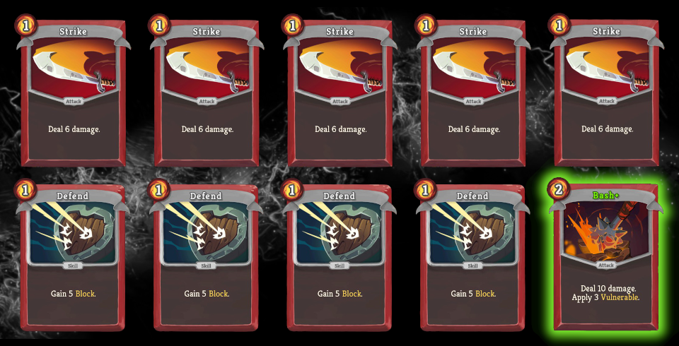
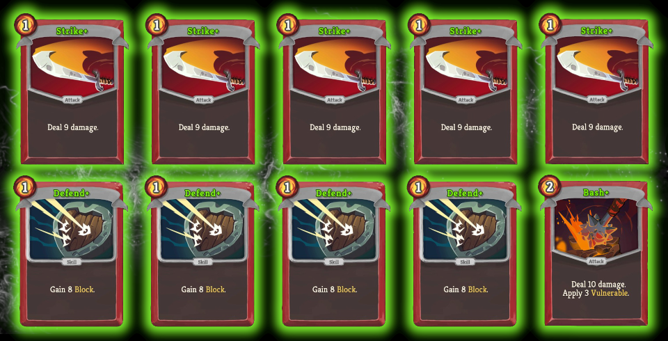
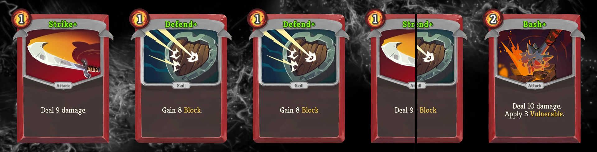
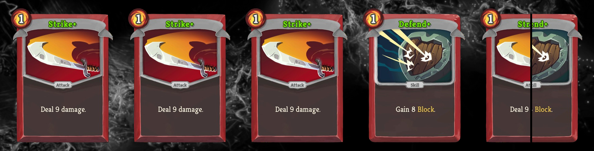
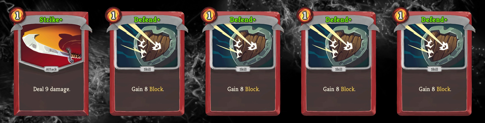
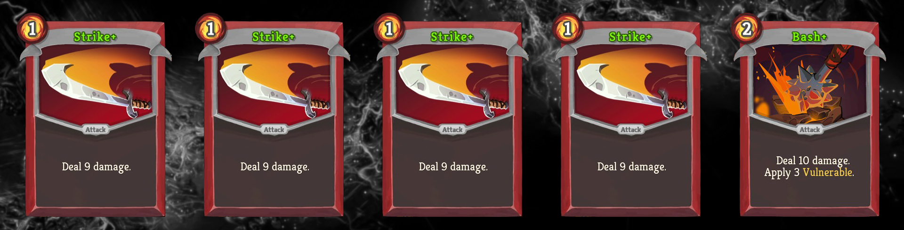

# Quiz #01: Solution

Below you will find the answers to the first [Quiz](README.md#quiz-01-gremlin-nob-vs-ironclad-basic-deck) from the [Slay the Spire Sensei series](/README.md#slay-the-spire-sensei) and some additional insights. If you have questions or find any mistakes in my analysis, don't hesitate to contact me on [Reddit](https://www.reddit.com/r/slaythespire/comments/cjhgy3/slay_the_spire_sensei_quiz_01_gremlin_nob_vs/) or [Twitter](https://twitter.com/Dementophobia).

If you haven't done so yet, try to answer the questions in advance before looking at the solutions, to get the most out of it. To see how some of the Slay the Spire experts on Reddit approached these questions, you can read through the corresponding [Reddit thread](https://www.reddit.com/r/slaythespire/comments/cjhgy3/slay_the_spire_sensei_quiz_01_gremlin_nob_vs/). Slay the Spire has a great community there!

### General Observations

One interesting aspect of the quiz is the fact that the deck contains exactly 10 cards and we draw 5 cards each turn. This means that we know what we will draw every other turn, because there are no cards in the deck messing with the draw pile or the discard pile. This makes the analysis way easier for us.

Nevertheless, the luck of the draw still plays a major role in the battles ahead, as you will see in the solution to question 3 and 4. This illustrates the importance of controlling card draw to get more consistent runs. Luckily, Slay the Spire provides a lot of tools to do so like additional card draw or search the piles for specific cards, just to name a few.

Please note that the answers include the effect of your starting relic ([Burning Blood](https://slay-the-spire.fandom.com/wiki/Burning_Blood)). So if you are off by 6 HP in your answers, this might be the reason.

### How does the Gremlin Nob encounter work

In this quiz we are always talking about the A18+ encounter, which has a predetermined attack pattern. Details can be found in the [Slay the Spire Wiki](https://slay-the-spire.fandom.com/wiki/Gremlin_Nob).

Therefore, the incoming damage to our Hero is predetermined for each round. It is common knowledge and can easily be verified, that blocking is only a valid option in the second to last turn before you kill the Gremlin Nob. Otherwise his Strength gain will upset your block in the long run. This leaves us with the following damage table for each round:

| Round | Damage done | Damage cumulative |
| ----- | ----------- | ----------------- |
| 1     | 0           | 0                 |
| 2     | 8           | 8                 |
| 3     | 24          | 32                |
| 4     | 24          | 56                |
| 5     | 8           | 64                |
| 6     | 24          | 88                |
| 7     | 24          | 112               |

If you haven't won be round 7, you are dead for sure. The difference between winning on round 2 and round 3 is significant, but in our given scenarios winning by round 2 is only possible in some specific cases.

### Solution to Question 1

You had the opportunity to choose between three upgrades before you start the fight:

A) Upgrade ONE of your Strikes

B) Upgrade your Bash

C) Upgrade ALL your Defends

And the winner is... **B) Upgrade your Bash**! Which has also been the clear favorite on Reddit. But you might be surprised how close those three options actually are! I also find it curios, that upgrading all Defends is slightly better than upgrading a single strike, although Defends are hardly used in this encounter. But before we talk actual numbers, here is the winning Deck:

The goal was beating the Gremlin Nob with as little HP loss as possible on average. How do our three options compare in this regard? As I bonus, I will throw in the deck without upgrades and one with two Strike upgrades as well on the bottom of the table.

| Option                        | Average HP after fight |
| ----------------------------- | ---------------------- |
| Upgrade ONE of your Strikes   | 42.09 HP               |
| **Upgrade your Bash**         | **43.47 HP**           |
| Upgrade ALL your Defends      | 42.27 HP               |
| *No Upgrades*                 | *38.19 HP*             |
| *Upgrade TWO of your Strikes* | *47.34 HP*             |

As you can see, the three options are within a range of less than 2 HP on average. This means there is still a clear winner, but in practice the difference is rather small.

### Solution to Question 2

From question 2 onwards we are playing with a fully upgraded starter deck:

We can extend our table from the solution to Question 1:

| Option (sorted by results)        | Average HP after fight |
| --------------------------------- | ---------------------- |
| No Upgrades                       | 38.19 HP               |
| Upgrade ONE of your Strikes       | 42.09 HP               |
| Upgrade ALL your Defends          | 42.27 HP               |
| Upgrade your Bash                 | 43.47 HP               |
| Upgrade TWO of your Strikes       | 47.34 HP               |
| **Upgrade the full starter deck** | **63.97 HP**           |

### Solution to Question 3

Now it is time to talk about initial draws. Which one would you like to see and which one would be the worst case? Analyzing these edge cases will also provide a sanity check for our solution to question 2.

#### Best Starting Hand

Let's start with the best case. There are actually two best cases possible, and taken together they are quite likely, happening more than 30% of each initial draw. We want a Bash+ and a Strike+ in our starting hand, accompanied by two or three blocks. **We will play the Bash+ and the Strike+ for our three energy**, so why do we care how many blocks we have?

The reason is the following turn. If you only draw zero or one Defend+ on turn one, the Defend+ will show up on turn 2, where we need three Strike+ for full impact!

This is the starting hand we would like to see:

How will this play out? **On turn 1, we deal 23 damage and apply 3 Vulnerable.** The Gremlin Nob uses Bellow and does not harm us yet. On turn 2, we will get the following hand:

**The Gremlin Nob is vulnerable and we can play 3 Strike+ for 39 damage, leaving him with 23/85 HP.** He will use Skull Bash to deal 8 damage and apply 2 Vulnerable to us.

Can we kill him on turn 3 before his devastating 24 damage attack? Sure we can, and it is quite likely that we will. Any two attack cards will do. Therefore, the only scenario in which we cannot kill him, is if we draw all 4 of our Defend+. This scenario has a probability below 2.5%, so we are usually good to go. Should it still happen, we play 3 Defend+, get hit for 9 damage and finish the Gremlin Nob off in the following round.

Therefore, we will most likely suffer 8 damage and in rare cases 17 damage. At the end of the combat our Burning Blood heals us for 6 HP. So, with the best case draw on turn 1, we will end up a little bit below 78 HP on average. This fits the simulated result by the Slay the Spire Sensei, which tells us that **we will keep 76.23 HP on average, when we draw the perfect starting hand**.

#### Worst Starting Hand

Unfortunately, we cannot assume that we always hit the Jackpot, when we draw our first hand. In 70% of all cases we will not! But what is the worst hand the game can offer us?

There are several hands fighting for the worst position, but there is one that wins by a tiny margin. Our winner (or loser) is... One Strike+ and four Defends!

Luckily for us, this scenario has a probability below 2%, but we are in a really bad spot if we hit it. We can only deal 9 damage, and blocking is especially worthless on turn 1, as the Gremlin Nob does not attack us. Turn 2 is predetermined and we will get the following hand next:

**We will apply 3 Vulnerable with Bash+ and play one of the Strike+. We deal 23 damage, reducing the Gremlin Nob's HP to 53/85.** Meanwhile we receive 8 damage and become vulnerable for 2 turns.

From here on the tree of possibilities widens, but on turn 3 we can hope for **3 Strike+ to deal 39 damage**. **That's the best case, leaving the Gremlin Nob at 14/85 HP.** We will get hit for 24 damage. If we are sure that we can win next turn, we will play a Defend+ (if we have one) to save 5 of our precious HPs. A bad draw on turn 3 might not give us this option and we will suffer the full 24 damage points, reducing us to 48/80 HP.

Assuming - if we play perfectly - that there is no way to let the Gremlin Nob live through turn 4, we will be left with 48 HP before Burning Blood (equals 54 HP after Burning Blood), which seems to be the worst case that can happen. Because a Defend+ on turn 3 will be possible most of the time, we should rather expect to end the fight with 54/80 HP after Burning Blood, leaving us with an **average of a little bit below 54/80 HP, if we see our worst case hand on turn 1**.

But does our assumption hold true? Or can the Gremlin Nob survive our turn 4 and deal 24 more damage to us? Unfortunately, there is an edge case where he can. And that's exactly when we draw our worst case hand on turn 3 a second time. In this case we will only be able to deal 13 damage with the single Strike+ and although the Vulnerability lasts until turn 4, we can only deal 39 damage with 3 more Strike+, **leaving the Gremlin Nob at exactly 1/85 HP**. Granted, this scenario is very unlikely (way below 0.1%), but if it happens, we are left with 30/80 HP after Burning Blood. We do not even have a block on the second to last turn to mitigate some of the damage. That's the absolute worst case, although we played the terrible cards we were dealt perfectly. Given the rarity of this scenario, it is an interesting edge case, but it will only diminish our expected results slightly.

This fits the simulated result by the Slay the Spire Sensei, which tells us that **we will keep 52.05 HP on average, when we draw the worst possible starting hand**.

### Solution to Question 4

After you have read the solutions to question 2 and 3, it is easy to calculate the difference between the best and the worst starting hand. **76.23 HP** is the best case, **52.05 HP** is the worst case, so the difference is **24.18 HP**.

That's the average of the best vs. the worst starting hand. If you followed the analysis carefully so far, you will have seen even more extreme cases, depending on the follow-up draws. Considering them as well, we end up with a best case of **78 HP** vs. the worst case of **30 HP**. This means a difference of **48 HP**. Granted, skill is an important part of Slay the Spire, but this analysis shows, that luck is also very important and sometimes you are just doomed by RNG!

### Solution to the Bonus Question

**Yes, there is a way to leave this fight with full HP.** Credit goes to the user [gaztaseven](https://www.reddit.com/user/gaztaseven/), who found this solution, which I missed initially. The trick is that you have to play not optimal considering average results, to achieve this outlier.

We start with the perfect draw from question 3.

We play Bash+ and Strike+ for 23 damage and draw turn 2.

The best play is playing three Strike+, because we cannot be sure to win on turn 3. But if we want to leave without damage, we have to play two Strike+ and one Defend+. That way, we receive only 3 instead of 8 damage! The Gremlin Nob ends turn 2 with 36/85 HP.

Now is the time to pray for three Strike+ in our hand for turn 3. This will kill the Gremlin Nob and we heal back to full HP to solve the riddle. If our prayer falls on deaf ears thou, we will end with a worse result than discussed in the solution to question 3.

How probable is this scenario? In addition to the 2 starting hands SDDDB and SSDDB from our perfect scenario, this also works with SSSDB, because we need one less Strike+ on turn 2. These starting hands have a cumulative probability of ~47.62%. Getting the three Strike+ on turn 3 has a probability of exactly 50%. **This leaves us with a probability of 23.81% to achieve this scenario from start to finish.**

### Overview of Starting Hands and Final Conclusion

We talked a lot about the impact of different starting hands. Let's finish our analysis with an overview of all possible starting hands, their probability and their expected average result. Again, we are using the fully upgraded deck (B is Bash+, S is Strike+ and D is Defend+) and we are talking about the HPs after Burning Blood healed us for 6 HP. Probabilities and HPs are rounded to two decimal points.

| Starting Hand | Probability in % | Expected HP after fight |
| ------------- | ---------------- | ----------------------- |
| SSDDB         | 23.81            | 76.23                   |
| SDDDB         | 7.94             | 76.23                   |
| SSSDD         | 23.81            | 60.11                   |
| SSSSD         | 7.94             | 60.11                   |
| DDDDB         | 0.40             | 57.55                   |
| SSSDB         | 15.87            | 57.55                   |
| SSSSS         | 0.40             | 56.95                   |
| SSDDD         | 15.87            | 56.84                   |
| SSSSB         | 1.98             | 52.34                   |
| SDDDD         | 19.84            | 52.05                   |
| **Any**       | **100**          | **63.97**               |

As you can see, the last line contains the most important of those numbers, the expected outcome before we know which hand we will draw. It is calculated by adding the weighted expected HPs off all the different scenarios and of course matches our solution to question 2.

This concludes the first analysis. I hope you learned something useful that you can apply in your own games. If you liked this format, you can follow me on [Twitter](https://twitter.com/Dementophobia), where I will announce future Slay the Spire Sensei quizzes and their respective analysis. Until next time, enjoy the game!