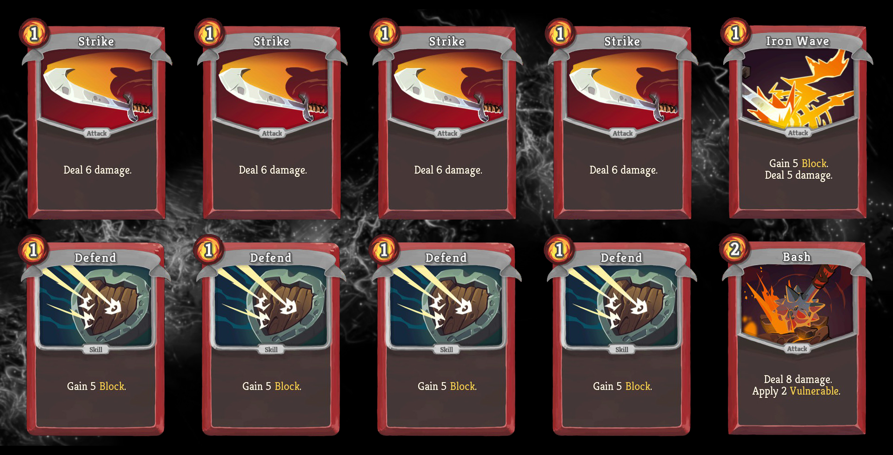
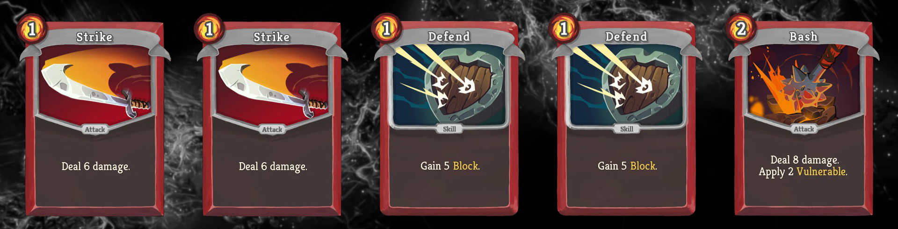
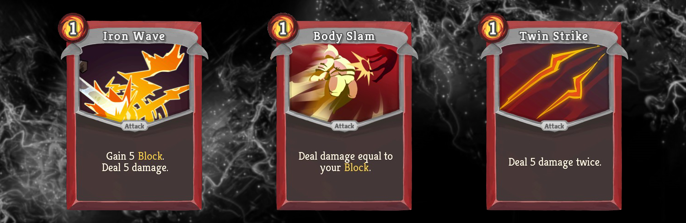

# Quiz #02: Cultist vs. Ironclad Act 1	

This is Quiz #02 from the [Slay the Spire Sensei series](../README.md#slay-the-spire-sensei). Try to answer the questions in advance before looking at the [solution](#solution), to get the most out of it. You might also want to check out the corresponding [Reddit thread](https://www.reddit.com/r/slaythespire/comments/cmq5y0/slay_the_spire_sensei_quiz_02_the_cultist_vs/). If you have any questions or feedback, drop me a line on [Twitter](https://twitter.com/Dementophobia) or comment on Reddit.

### Preface

You can [jump to the quiz directly](#environment-for-the-quiz) if you don't care about the preface.

I learned a lot from the feedback the amazing Slay the Spire community gave me concerning the [first quiz](../Quiz-01-Gremlin-Nob-vs-Ironclad-Basic-Deck/README.md#quiz-01-gremlin-nob-vs-ironclad-basic-deck) I created. Thank you all for the warm reception and the helpful critique. I will try to include as much of it as I can in the current and future quizzes.

First of all, people were asking for more realistic scenarios that are directly applicable in their games. That's why I will re-create scenarios from my own games and work more with "what's the correct play" type of questions from now on.

I also got a request to include not only the best average play scenarios but also the full range of outcomes, so that you know how much you have to gamble for a shot at the ideal result. Sometimes playing for the best average result is not enough and you need to aim for moves that will result in worse scenarios on average but have the chance to be far better if you are lucky.

To be able to provide a broader range of information I extended the reporting capabilities of the Slay the Spire Sensei along with the necessary engine upgrades to support the new scenarios of the current quiz.

### Environment for the Quiz

Today we are talking about an early encounter in Act 1 that everyone is familiar with - the [Cultist](https://slay-the-spire.fandom.com/wiki/Cultist)! His powers are unmatched, but we will try our best nevertheless.

You are fighting with the [Ironclad](https://slay-the-spire.fandom.com/wiki/Ironclad), this is the second encounter in your run. You have your starting relic ([Burning Blood](https://slay-the-spire.fandom.com/wiki/Burning_Blood)), removed one of your Strikes at [Neow](https://slay-the-spire.fandom.com/wiki/Neow) and got an Iron Wave after the first fight. You are slightly damaged (**74/80 HP**) and have **3/3 Energy**. You do not have any potions yet. You draw 5 cards each turn. This is your deck:

In this quiz you are confronted with different choices. A scenario always consists of a given game state and your goal. After your initial choice has been played, we assume you are able to play the rest of the fight perfectly concerning your goal.

We are running at **Ascension 7**, the Cultist starts with **50/50 HP**. Details about the Ascension 7 version of the Cultist can be found in the [Slay the Spire Wiki](https://slay-the-spire.fandom.com/wiki/Cultist). He basically starts with Incantation to gain Ritual 4 during his first turn and uses Dark Strike to deal 6 damage every turn after. Once he gained Ritual 4, he gains 4 Strength at the end of every turn. This means he deals 6 damage on turn 2, 10 damage on turn 3, and so on.

### Question 1

You are on turn 2 of this fight. In your fist turn you played **two Strikes** and **one Iron Wave**. The health of the Cultist is down to **33/50 HP** and he just gained **Ritual 4**. Now it is your second turn. The Cultist intends to **attack for 6 damage**.

You have drawn the following hand on turn 2:

You want to beat the Cultist, losing as little HP as possible **on average**. Which cards do you play this turn?

### Question 2

You find yourself in the same scenario as in question 1, but this time you want to **aim for the best possible scenario**, even if you are unlikely to hit this jackpot. How do you play for a chance to lose as little HP as possible? And if really turn out to be that lucky, how much HP do you have left when you travel on?

### Question 3

Once more you find yourself in the same scenario. But again, your goal is different that time. You want to **cut your losses** and ensure that even if your luck turns against you, you suffer as little as possible. Which is the safest route that guarantees you the best outcome, even if fate is not on your side? How many HP will you have left if the worst case happens?

### Bonus Question

You might wonder about the potential alternatives you could have selected instead of **Iron Wave** when you won the first fight. It's no secret, they have been **Body Slam** and **Twin Strike**.

Neglecting the rest of the run, just talking about the Cultist encounter. Which of the choices would have been best **on average**? Would you have taken Iron Wave as well or one of the other possibilities? If you are really motivated, you can also take the potential **best and worst case scenarios** into account for each card choice.

Please note that we are now talking about the full fight against the Cultist including all possibilities. We are **not** talking about the previous setup where you start on turn 2. All potential turn 1 draws must be considered for the bonus question.

Which card is it? Pick your poison!

### Solution

You have solved all the questions and have written down your solution? Than it is time to check if you're right. The solution also contains additional information about the scenario.

[Yes, take me to the solution!](Solution.md#quiz-02-solution)