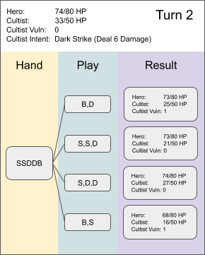
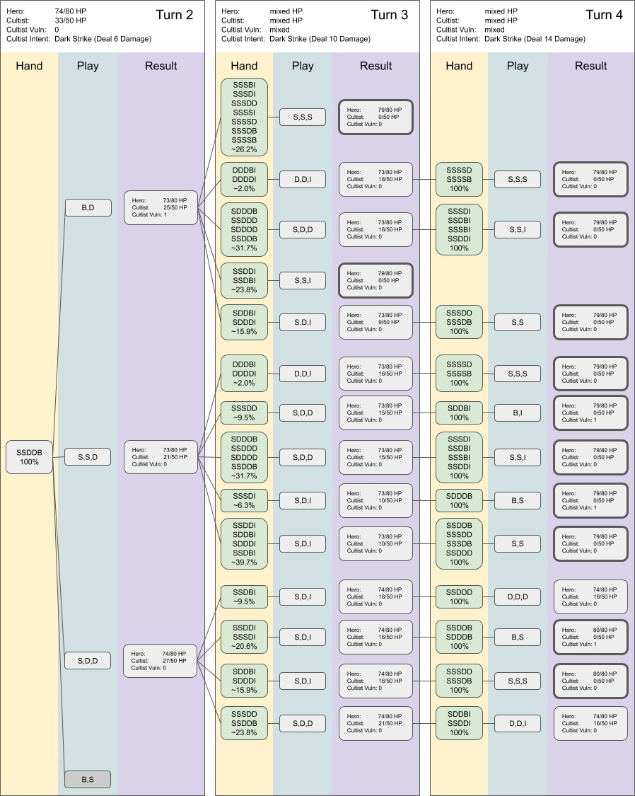
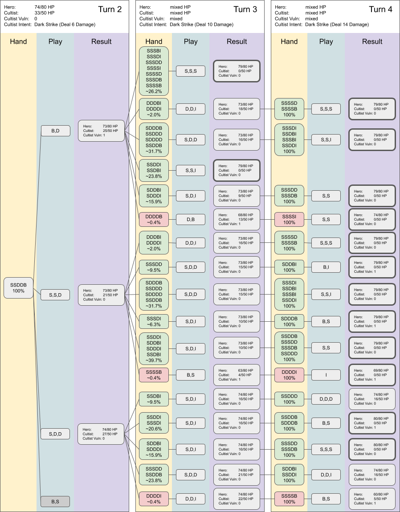

# Quiz #02: Solution

Below you will find the answers to the second [Quiz](README.md#quiz-02-cultist-vs-ironclad-act-1) from the [Slay the Spire Sensei series](../README.md#slay-the-spire-sensei) and some additional insights. If you have questions or find any mistakes in my analysis, don't hesitate to contact me on [Reddit](https://www.reddit.com/r/slaythespire/) or [Twitter](https://twitter.com/Dementophobia).

If you haven't done so yet, try to answer the questions in advance before looking at the solutions, to get the most out of it. To see how some of the Slay the Spire experts on Reddit approached these questions, you can read through the corresponding [Reddit thread](https://www.reddit.com/r/slaythespire/). Slay the Spire has a great community there!

### General Observations

Like in the first quiz, the deck contains exactly 10 cards and we draw 5 cards each turn. This means that we know what we will draw every other turn, because there are no cards in the deck messing with the draw pile or the discard pile. This makes the analysis way easier for us.

Nevertheless, the further we analyze a specific line of play, to more the decision tree branches and the random aspect of drawing cards also creates a lot of additional possibilities to consider. Therefore, the detailed analysis has to become more vague as we go into later turns.

Wouldn't it be possible to analyze every branch in detail? Well, obviously it would be possible, but on turn 3 we are already facing 18 potential draws and most of them offer more than one reasonable line of play. That's why we have to rely on the simulations by the Slay the Spire Sensei to calculate the expected values of our plays. To calculate the average outcome, we need to take all relevant branches into consideration. That's especially true for question 1, where we are focused on those averages.

Question 2 and 3 are different in this regard. They also have to deal with the huge amount of variations, but after we have calculated the perfect routes, we can select the relevant branches and discuss them in detail. In those cases we don't care about averages but only the best and worst case scenarios.

Please note that the answers include the effect of your starting relic ([Burning Blood](https://slay-the-spire.fandom.com/wiki/Burning_Blood)). So if you are off by 6 HP in your answers, this might be the reason.

### How does the Cultist encounter work

In this quiz we are always talking about the A7 encounter, which has a predetermined attack pattern. Details can be found in the [Slay the Spire Wiki](https://slay-the-spire.fandom.com/wiki/Cultist).

Therefore, the incoming damage to our Hero is predetermined for each round. The Cultist becomes significantly stronger with each round, so time is of the essence. There is still a lot of room for blocking, which is required in the right amount to get to the best possible results.

This leaves us with the following damage table for each round:

| Round | Damage done | Damage cumulative |
| ----- | ----------- | ----------------- |
| 1     | 0           | 0                 |
| 2     | 6           | 6                 |
| 3     | 10          | 16                |
| 4     | 14          | 30                |
| 5     | 18          | 48                |

If you haven't won by round 5 with this deck, you must have made major mistakes during this fight.

### Solution to Question 1

There are 4 different options that you have, ignoring the obviously inferior ones. Let's look at all four of them statistic wise, based on the results of the Slay the Spire Sensei:

| Play Sequence            | Average HP remaining |
| ------------------------ | -------------------- |
| Bash - Defend            | 78.98 HP             |
| Strike - Strike - Defend | 78.44 HP             |
| Strike - Defend - Defend | 78.32 HP             |
| Bash - Strike            | 74.00 HP             |

First of all, the differences between the top 3 choices are really small on average. We are talking about a range of less than 1 HP between the best and the third best option. The only line of play that is clearly inferior is **Bash - Strike**, which will result in a loss of more than 4 HP on average. And as you might have already experienced, this can potentially be the difference between victory and defeat as the run goes on. Every HP counts!

Let's take a look at the result of the four potential play sequences on turn 2:

This overview by itself doesn't explain why **Bash - Defend** is the best option. Therefore, I would like to analyze this variation further.

We deal **8 Damage**, apply **2 Vulnerable** and gain **5 Block**. The Cultist attacks for **6 damage**, therefore we end this turn with **73/80 HP** and the Cultist is left with **25/50 HP**. Will we be able to kill him on turn 3? Possibly, if we are lucky to draw **3 Strikes** or **2 Strikes and 1 Iron Wave**.

But even if we don't, we are in a solid position to **block all 10 damage** the Cultist will throw at us on turn 3 and **squeeze in 9 or even 16 damage** ourselves, depending on our draw on turn 3. This will push the Cultist's HP low enough for a clean kill on turn 4. Only one very specific edge case (drawing DDDDB on turn 3) is troublesome, therefore we will almost always (**99.6%** of times) end the fight with **73/80 HP**, healing back with Burning Blood to **79/80 HP**. The result for this line of play is a little bit below this number, because of the mentioned edge case.

**Strike - Strike - Defend** is a close second. You can see the main difference in the tree chart above. We deal 4 more damage on turn 2, but we do not apply Vulnerable. This means a clean kill on turn 3 is impossible. Again we are very likely to block all incoming damage on turn 3 and squeeze in some damage to set up the kill on turn 4, but there are several more edge cases that will foil our plan. Still, most games following this line of play will also end with **79/80 HP**, but there are several more cases where we leave with less HP. Therefore, the average is a little lower than the average of the correct solution.

**Strike - Defend - Defend** is also a tempting variation, because we do not take a single point of damage. This looks like it has the potential to be the best result if we can kill the Cultist without taking any further damage on the next turns as well. Analysis shows, that this is a real possibility, as we will see in the solution to question 2. But on average the chance is even higher that we take addition damage during the following turns, compared to the other two lines of play we've discussed so far. With the Cultist at **27/50 HP** and **no Vulnerable** applied, there is a lot more space for things to go wrong before the kill.

And finally, the **Bash - Strike** looks like a fast, aggressive and reasonable approach, but it falls short as it costs as 6 HP right away. No matter how we continue, there is no way to catch up with the other lines of play if we take this initial hit. At least we can be sure that we cannot drop any further than that.

Keep in mind that we are still talking about average outcomes. The solutions to question 2 and 3 will focus on the best and worst cases instead.

### Solution to Question 2

Going after the play that gives you the best average might not always be enough. Sometimes you have to aim for above average results, although this requires a line of play that might be worse on average. But if you are lucky, taking this risk may put you in a much better position to win this specific run.

I expanded the table from question 1 to include the best possible outcomes and their probability of happening:

| Play Sequence            | Average HP remaining | Most HP remaining |
| ------------------------ | -------------------- | ----------------- |
| Bash - Defend            | 78.98 HP             | 79 HP (99.6%)     |
| Strike - Strike - Defend | 78.44 HP             | 79 HP (89.3%)     |
| Strike - Defend - Defend | 78.32 HP             | 80 HP (63.1%)     |
| Bash - Strike            | 74.00 HP             | 74 HP (100%)      |

Now we suddenly have to rethink our ranking. **Bash - Defend** and **Strike - Strike - Defend** both have the possibility to end with **79/80 HP**, but **Strike - Defend - Defend** can end with **80/80 HP**. Sure, on average the first two options are a little better, but if we are willing to gamble for this additional HP, now is the chance. 

Is it the right move in this situation? That's your judgement to make. As you can see, you will hit the **80/80 HP** jackpot only in **63,1%** of the times you try. The other times you will end up worse. It has to be that way, otherwise the average wouldn't be lower of course. My gut feeling says to go for the almost guaranteed **79/80 HP** with **Bash - Defend**, but I tend to be rather conservative in my gambling choices.

To understand what's behind this analysis and to allow you a deep dive into the numbers, I've prepared a tree showing the paths to the best outcomes. I skipped the inferior **Bash - Strike** maneuver, because it is clearly not a reasonable line of play.

As you can see, there are a lot of different draw combinations after we play **Bash - Defend**, which will lead to the desired outcome. This comes as no surprise, as their probability has to add up to **99.6%** of all draws. The bold blocks in the Result area show us where the fights end. Some of those end on turn 3, others on turn 4, depending on our draws. But all lines of play portrayed end in the best case scenario, **79/80 HP** in the case of **Bash - Defend**.

The same holds true for **Strike - Strike - Defend**, although, as we have already discussed during the solution of question 1, there is no way to win on turn 3. 

Looking further down to **Strike - Defend - Defend**, we see something interesting. Not all of the fights end on turn 4. In some cases we have to play **Defend - Defend - Defend** on turn 4 for a chance to survive with **80/80 HP**. Do all of those cases allow us to win without harm on turn 5? Unfortunately they don't, as we need to deal **16 Damage** to beat the cultist. If our hand does not allow that, we cannot block all the 18 incoming Damage from the Cultist, so we will lose some HPs. How often will we hit the right hand on turn 5? As I didn't want to draw all variations for turn 5 as well, I asked the Slay the Spire Sensei, which told me that we will win flawless on turn 5 in around **80%** of cases.

If you have paid close attention, you might have realized that the probabilities of the hands for a given line of play add up to the percentage shown in the table above. Of course they have to, but for **Strike - Defend - Defend** some percentage points are missing. How can this be?

The reason for this is that we have to consider the chance of failure on turn 5. Take a look at the two lines of play that are not concluded on turn 4 and you will see that their probability to happen based on the draw on turn 3 are **9,5% plus 23.8%**. Those probabilities cannot be taken at face value though, because we have seen that in about **20%** of cases they will not result in the desired outcome. Therefore, they have to be multiplied by **0.8** to get the real probabilities. After this correction, the sum of all probabilities for this line of play match the sum from the table above.

Fun fact: No matter what happens after **Bash - Strike**, you always end with **74/80 HP** if you play perfectly from there on.

### Solution to Question 3

Question 3 offers another viewpoint on the same problem. This time we are not aiming for the stars but rather try to cut our losses. You wouldn't usually play that way, especially early in the run like in our scenario, but understanding what's the worst case outcome can help us to understand our choices even better.

I expanded the table again to include the worst possible outcomes:

| Play Sequence            | Average HP remaining | Most HP remaining | Least HP remaining |
| ------------------------ | -------------------- | ----------------- | ------------------ |
| Bash - Defend            | 78.98 HP             | 79 HP (99.6%)     | 74 HP (0.4%)       |
| Strike - Strike - Defend | 78.44 HP             | 79 HP (89.3%)     | 69 HP (0.4%)       |
| Strike - Defend - Defend | 78.32 HP             | 80 HP (63.1%)     | 66 HP (0.4%)       |
| Bash - Strike            | 74.00 HP             | 74 HP (100%)      | 74 HP (100%)       |

Now that's interesting! The differences are very small, but from this point of view, the option **Bash - Defend** looks even better than before. Granted, the chances for the worst cases happening in the different lines of play (except for **Bash - Strike**) are rather slim with 0.4% each, but the potential HP loss is significant.

Imagine gambling for **80/80 HP** with **Strike - Defend - Defend** and ending the fight with **66/80 HP** because of terrible luck. Is this risk worth the possible reward? I don't think so.

We can add our worst case branches to our tree to get an even more comprehensive view. Of course we could add all the possible results in between as well, but this would grow the tree even larger.

The three new entries can be easily identified by their color. The system should be self explanatory by now, but I'd like to analyze the worst cases a little bit, because they are such interesting edge cases.

The only hand we don't want to see on turn 3 after playing **Bash - Defend** is **DDDDB**. We can try to block all incoming damage, but this will not allow us to do any additional damage to the Cultist. And this means we cannot win on turn 4 either. Therefore, we have to accept 5 damage points, bash him once more and finish him off on turn 4.

After **Strike - Strike - Defend** the worst case would be drawing **SSSSB**. There is no way to kill the Cultist and no way to block a single point of damage. We can **Bash - Strike** him for a sure kill on turn 4 with Iron Wave, but the 10 damage we are suffering will stick with us. **69/80 HP** is the result of this line of play.

And finally, the worst of the worst cases. We decide to gamble and play **Strike - Defend - Defend**. Luck is not on our side and we draw **DDDDI**. Sure, we have more than enough Block and can even deal 5 damage to the cultist, but on turn 4 we cannot kill him and we are also out of any defensive cards. 14 damage straight to the face leaves us with only **66/80 HP** after we finally kill the Cultist on turn 5 and heal back up with Burning Blood.

### Solution to the Bonus Question

Before we come to the solution for our bonus question, let's take a look at the numbers. Please note that the values for **Iron Wave** are a little different from our previous solutions, as we are now considering all potential draws on turn 1 and deal with many additional variations:

| Card Choice     | Average HP remaining | Most HP remaining | Least HP remaining |
| --------------- | -------------------- | ----------------- | ------------------ |
| Iron Wave       | 79.14 HP             | 80                | 60                 |
| Body Slam       | 77.64 HP             | 80                | 69                 |
| **Twin Strike** | **79.25 HP**         | **80**            | **69**             |

As you can see, **Iron Wave** is even better on average than shown in question 1. This indicates, that our turn 1 draw in question 1 was not the best possible turn 1 draw. The best case can't be better than **80/80 HP** and since it is a best case scenario, it cannot get worse than shown in question 2 by expanding our options. Therefore, anything else than 80 HP would have been a troublesome result. Finally, we found an even worse worst case than in question 3. If we play to cut our losses and are really unlucky, we might end up with only **60/80 HP** after the fight.

**Body Slam** is **1.5 HP** worse on average compared to **Iron Wave**. It obviously requires a block oriented deck to shine. In our current deck it is clearly inferior. Nevertheless, we would be able to pull of a flawless game with this card as well and end with **80/80 HP** if we are lucky. Chances are smaller for this to happen, but it is still possible. Our cutting losses scenario shows, that we can at least ensure that we do not drop below **69/80 HP**, if that's our goal.

**Twin Strike** adds a little more punch to our deck, but at the cost of defense. This results in an average of **79.25 HP** after the fight, which is even better than the results with the more balanced **Iron Wave**. The dream scenario of **80/80 HP** is also possible with this card. If you want to cut your losses, you will still run the risk of suffering some additional damage and leave the fight with **69/80 HP**. That's also better than **Iron Wave**. This card choice feels like the most consistent one against the Cultist and is therefore the solution to the bonus question.

### Final Conclusion

As we have seen, there are different aspects you have to consider when playing your cards. You don't always play for the best average outcome. Sometimes it is crucial to gamble for a better outcome and sometimes it is enough to cut your losses. Knowing the potential of each strategy is key to make the right decision.

This line of thought can be extended to deck building as well, as we have seen in the bonus question. If you want to judge the viability of a card choice for your current deck in your current situation, analyzing upcoming encounters and the effect of those card choices is at least one aspect to consider.

This concludes the analysis of Quiz #2. I hope you learned something useful that you can apply in your own games. If you liked this format, you can follow me on [Twitter](https://twitter.com/Dementophobia), where I will announce future Slay the Spire Sensei quizzes and their respective analysis. Until next time, enjoy the game!