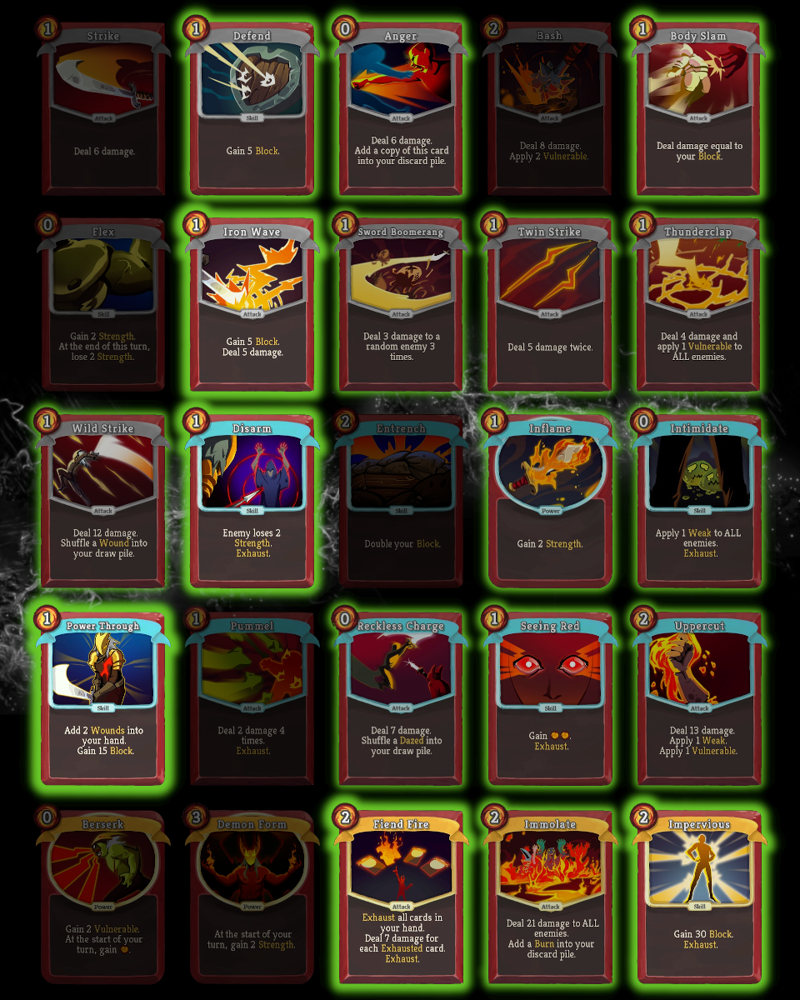
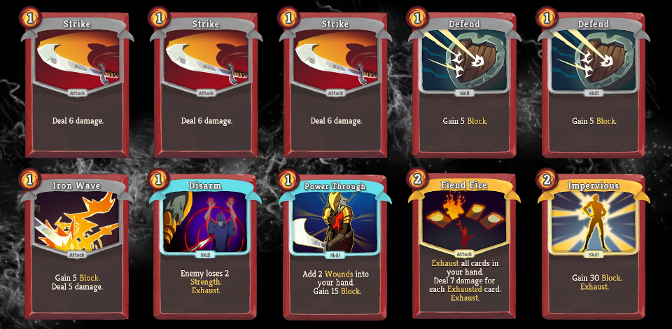

# Quiz #03: Solution

[Quiz #3](README.md#quiz-03-jaw-worm-vs-reddit-decks) from the [Slay the Spire Sensei series](../README.md#slay-the-spire-sensei) is finished and after 48 hours, the Reddit community submitted **34** unique decks. Many but not all cards from the card pool have been used. The following overview shows, which cards were included the most. The intensity of the glow of the cards shows the inclusion rate, cards without glow have not been used.

The clear VIP in the card pool was **Power Through** with an inclusion rate of **79.4%**, followed by **Iron Wave 67.6%**, **Fiend Fire 61.8%**, **Disarm 58.8%** and **Impervious 55.9%**. It's interesting to compare those picks with the [Spirelogs Tier List](https://spirelogs.com/stats/ironclad/tierlist.php) for the Ironclad. Obviously, we are analyzing a single and early game scenario here, while Spirelogs focuses on a full run. Therefore, the results will of course differ a lot. I still found it curious that the top 3 cards from the pool according to Spirelogs (Entrench, Demon Form, Uppercut) were almost not used, except for a single Uppercut. This shows how important card selection is for specific scenarios. While the three mentioned cards are incredible valuable in a Slay the Spire run, they don't do anything for us in this specific scenario.

### Analyzing the decks

In hindsight, I have to admit making a mistake while assembling the card pool. I underestimated the complexity the card Power Through - unfortunately also the most picked card - introduces to the simulation. Every second turn it has the potential to add 2 more cards to the deck, which leads to an unexpected large explosion of draw variations.

The Slay the Spire Sensei **doesn't** just **estimate** the best plays, it **fully simulates all possible variations** to get the best possible solution. This means, that I can implement optimizations, but no real shortcuts. This made simulating the decks more time consuming than expected. Some decks already require **over five hours to simulate the first 4 turns**. The simulation data for one of the decks grew to **over 7 GB within the first 4 turns**. Turn 5 multiplies this manifold. That's why calculating the solution will take way longer than expected. I have some ideas on how to improve the engine and make it more efficient, but this requires merging the simulation and the analysis logic, which will be a major refactoring effort. Therefore, I will limit the analysis to the first four turns for now.

Nevertheless, this unexpected problem gave me an interesting idea for the analysis.

The rules state, that you will lose if you haven't won after turn five. But we can also test how the different decks perform with even tighter time limits. Some will do better than others on shorter time limits, while their performance may chance with longer time spans. This view can help the analysis of the deck quality and consistency, so I decided to analyze all decks for all time limits from 1 to 4 turns.

I can't guarantee that I'll find the time for the required major overhaul of the Sensei soon. I'll keep updating the [Reddit thread](https://www.reddit.com/r/slaythespire/comments/cr4vcf/slay_the_spire_sensei_quiz_03_jaw_worm_vs_reddit/) and you can also follow me in [Twitter](https://twitter.com/Dementophobia) to get informed as soon as a new update has been published.

### Performance of the decks for different turn limits

Let's start with the table containing all decks and their **probability of winning within the different time limits**; of course without taking a single point of damage.

You can click on all the percentages to get to an overview of the automated first turn analysis. Of course the Sensei could generate the same for the follow-up turns as well, but based on the branching this would soon get really large and I don't won't to push TBs of data on GitHub.

| Deck               | User                                                         | Turn 1                                   | Turn 2                                    | Turn 3                                    | Turn 4                                    |
| ------------------ | ------------------------------------------------------------ | ---------------------------------------- | ----------------------------------------- | ----------------------------------------- | ----------------------------------------- |
| D, BS, PT, FF, IV  | [MrBarskih](https://www.reddit.com/user/MrBarskih)           | [0.00%](results/D-BS-PT-FF-IV_0.md)      | [44.05%](results/D-BS-PT-FF-IV_1.md)      | [69.26%](results/D-BS-PT-FF-IV_2.md)      | [77.50%](results/D-BS-PT-FF-IV_3.md)      |
| BS, IW, DI, PT, IV | [Reach268](https://www.reddit.com/user/Reach268/)            | [0.00%](results/BS-IW-DI-PT-IV_0.md)     | [11.11%](results/BS-IW-DI-PT-IV_1.md)     | [46.85%](results/BS-IW-DI-PT-IV_2.md)     | [67.26%](results/BS-IW-DI-PT-IV_3.md)     |
| AN, IW, PT, FF, IV | [Olmanwes](https://www.reddit.com/user/olmanwes/)            | [0.00%](results/AN-IW-PT-FF-IV_0.md)     | [40.08%](results/AN-IW-PT-FF-IV_1.md)     | [66.52%](results/AN-IW-PT-FF-IV_2.md)     | [76.79%](results/AN-IW-PT-FF-IV_3.md)     |
| D, DI, PT, FF, IM  | [Quentin500000000](https://www.reddit.com/user/quentin500000000/) | [0.00%](results/D-DI-PT-FF-IM_0.md)      | [34.92%](results/D-DI-PT-FF-IM_1.md)      | [55.19%](results/D-DI-PT-FF-IM_2.md)      | [64.02%](results/D-DI-PT-FF-IM_3.md)      |
| BB, IW, PT, FF, IV | [Xyz664](https://www.reddit.com/user/xyz664/)                | [0.00%](results/BB-IW-PT-FF-IV_0.md)     | [28.12%](results/BB-IW-PT-FF-IV_1.md)     | [51.30%](results/BB-IW-PT-FF-IV_2.md)     | [72.87%](results/BB-IW-PT-FF-IV_3.md)     |
| BS, IW, PT, SR, IV | [Equisential](https://www.reddit.com/user/Equisential/)      | [2.38%](results/BS-IW-PT-SR-IV_0.md)     | [23.02%](results/BS-IW-PT-SR-IV_1.md)     | [53.41%](results/BS-IW-PT-SR-IV_2.md)     | [69.42%](results/BS-IW-PT-SR-IV_3.md)     |
| D, BS, IW, PT, IV  | [NintenTim](https://www.reddit.com/user/NintenTim/)          | [0.00%](results/D-BS-IW-PT-IV_0.md)      | [11.11%](results/D-BS-IW-PT-IV_1.md)      | [45.18%](results/D-BS-IW-PT-IV_2.md)      | [64.95%](results/D-BS-IW-PT-IV_3.md)      |
| D, AN, IW, PT, FF  | [TyphoonJoe](https://www.reddit.com/user/TyphoonJoe/)        | [0.00%](results/D-AN-IW-PT-FF_0.md)      | [34.92%](results/D-AN-IW-PT-FF_1.md)      | [54.39%](results/D-AN-IW-PT-FF_2.md)      | [62.64%](results/D-AN-IW-PT-FF_3.md)      |
| AN, IW, DI, IF, FF | [Dud3inator](https://www.reddit.com/user/dud3inator/)        | [0.00%](results/AN-IW-DI-IF-FF_0.md)     | [0.00%](results/AN-IW-DI-IF-FF_1.md)      | [19.48%](results/AN-IW-DI-IF-FF_2.md)     | [22.38%](results/AN-IW-DI-IF-FF_3.md)     |
| BS, PT, SR, IM, IV | [SunkenDota](https://www.reddit.com/user/SunkenDota/)        | [2.38%](results/BS-PT-SR-IM-IV_0.md)     | [37.30%](results/BS-PT-SR-IM-IV_1.md)     | [66.02%](results/BS-PT-SR-IM-IV_2.md)     | [71.35%](results/BS-PT-SR-IM-IV_3.md)     |
| DI, IF, IN, PT, FF | [Chromosis](https://www.reddit.com/user/Chromosis/)          | [0.00%](results/DI-IF-IN-PT-FF_0.md)     | [17.46%](results/DI-IF-IN-PT-FF_1.md)     | [43.76%](results/DI-IF-IN-PT-FF_2.md)     | [55.50%](results/DI-IF-IN-PT-FF_3.md)     |
| IW, DI, PT, FF, IV | [Figgy20000](https://www.reddit.com/user/Figgy20000/)        | [0.00%](results/IW-DI-PT-FF-IV_0.md)     | [20.63%](results/IW-DI-PT-FF-IV_1.md)     | [58.55%](results/IW-DI-PT-FF-IV_2.md)     | **[79.79%](results/IW-DI-PT-FF-IV_3.md)** |
| DI, PT, FF, IM, IV | [Rocanaan](https://www.reddit.com/user/rocanaan/)            | [0.00%](results/DI-PT-FF-IM-IV_0.md)     | [34.92%](results/DI-PT-FF-IM-IV_1.md)     | [67.14%](results/DI-PT-FF-IM-IV_2.md)     | [76.79%](results/DI-PT-FF-IM-IV_3.md)     |
| IW, DI, IN, PT, FF | [Pyren-Kyr](https://www.reddit.com/user/Pyren-Kyr/)          | [0.00%](results/IW-DI-IN-PT-FF_0.md)     | [26.59%](results/IW-DI-IN-PT-FF_1.md)     | [54.61%](results/IW-DI-IN-PT-FF_2.md)     | [70.66%](results/IW-DI-IN-PT-FF_3.md)     |
| AN, PT, RC, FF, IM | [Hubristank](https://www.reddit.com/user/hubristank/)        | [0.00%](results/AN-PT-RC-FF-IM_0.md)     | [49.21%](results/AN-PT-RC-FF-IM_1.md)     | [49.67%](results/AN-PT-RC-FF-IM_2.md)     | [--.--%](results/AN-PT-RC-FF-IM_3.md)     |
| IW, DI, IF, FF, IV | [Meltrix](https://www.reddit.com/user/Meltrix/)              | [0.00%](results/IW-DI-IF-FF-IV_0.md)     | [0.00%](results/IW-DI-IF-FF-IV_1.md)      | [30.37%](results/IW-DI-IF-FF-IV_2.md)     | [56.74%](results/IW-DI-IF-FF-IV_3.md)     |
| BS, PT, FF, IM, IV | [Romain672](https://www.reddit.com/user/Romain672/)          | [0.00%](results/BS-PT-FF-IM-IV_0.md)     | **[56.75%](results/BS-PT-FF-IM-IV_1.md)** | [73.91%](results/BS-PT-FF-IM-IV_2.md)     | [75.63%](results/BS-PT-FF-IM-IV_3.md)     |
| AN, IW, DI, UP, IV | [Sanity__](https://www.reddit.com/user/Sanity__)             | [0.00%](results/AN-IW-DI-UP-IV_0.md)     | [0.00%](results/AN-IW-DI-UP-IV_1.md)      | [41.99%](results/AN-IW-DI-UP-IV_2.md)     | [61.56%](results/AN-IW-DI-UP-IV_3.md)     |
| D, IW, DI, SR, IM  | [LuxTheOmnicaster](https://www.reddit.com/user/LuxTheOmnicaster) | [0.00%](results/D-IW-DI-SR-IM_0.md)      | [0.00%](results/D-IW-DI-SR-IM_1.md)       | [19.77%](results/D-IW-DI-SR-IM_2.md)      | [38.23%](results/D-IW-DI-SR-IM_3.md)      |
| IW, TH, DI, PT, FF | [Gaztaseven](https://www.reddit.com/user/gaztaseven)         | [0.00%](results/IW-TH-DI-PT-FF_0.md)     | [34.52%](results/IW-TH-DI-PT-FF_1.md)     | [57.73%](results/IW-TH-DI-PT-FF_2.md)     | [65.82%](results/IW-TH-DI-PT-FF_3.md)     |
| D, TS, DI, IF, PT  | [Newtype22](https://www.reddit.com/user/Newtype22)           | [0.00%](results/D-TS-DI-IF-PT_0.md)      | [0.00%](results/D-TS-DI-IF-PT_1.md)       | [16.18%](results/D-TS-DI-IF-PT_2.md)      | [46.37%](results/D-TS-DI-IF-PT_3.md)      |
| D, IW, DI, PT, FF  | [KingOfBritains](https://www.reddit.com/user/KingOfBritains) | [0.00%](results/D-IW-DI-PT-FF_0.md)      | [20.63%](results/D-IW-DI-PT-FF_1.md)      | [50.02%](results/D-IW-DI-PT-FF_2.md)      | [72.69%](results/D-IW-DI-PT-FF_3.md)      |
| IW, WS, PT, FF, IV | [Cadetsea](https://www.reddit.com/user/cadetsea)             | [0.00%](results/IW-WS-PT-IV-FF_0.md)     | [47.49%](results/IW-WS-PT-IV-FF_1.md)     | [70.80%](results/IW-WS-PT-IV-FF_2.md)     | [77.92%](results/IW-WS-PT-IV-FF_3.md)     |
| D, BS, IW, DI, IV  | [MemesMemesMemesMemes](https://www.reddit.com/user/MemesMemesMemesMemes) | [0.00%](results/D-BS-IW-DI-IV_0.md)      | [11.11%](results/D-BS-IW-DI-IV_1.md)      | [28.94%](results/D-BS-IW-DI-IV_2.md)      | [50.31%](results/D-BS-IW-DI-IV_3.md)      |
| BS, IW, PT, FF, IV | [SpencerWS](https://www.reddit.com/user/SpencerWS)           | [0.00%](results/BS-IW-PT-FF-IV_0.md)     | [47.62%](results/BS-IW-PT-FF-IV_1.md)     | **[74.50%](results/BS-IW-PT-FF-IV_2.md)** | [78.74%](results/BS-IW-PT-FF-IV_3.md)     |
| D, IW, PT, FF, IV  | [Zwetsbaard](https://www.reddit.com/user/zwetsbaard)         | [0.00%](results/D-IW-PT-FF-IV_0.md)      | [20.63%](results/D-IW-PT-FF-IV_1.md)      | [56.58%](results/D-IW-PT-FF-IV_2.md)      | [77.15%](results/D-IW-PT-FF-IV_3.md)      |
| D, IW, TS, DI, SR  | [Eddietheintern](https://www.reddit.com/user/eddietheintern) | [0.00%](results/D-IW-TS-DI-SR_0.md)      | [0.00%](results/D-IW-TS-DI-SR_1.md)       | [3.59%](results/D-IW-TS-DI-SR_2.md)       | [25.41%](results/D-IW-TS-DI-SR_3.md)      |
| IW, SB, TH, DI, PT | [Bakuganzack](https://www.reddit.com/user/bakuganzack)       | [0.00%](results/IW-SB-TH-DI-PT_0.md)     | [0.00%](results/IW-SB-TH-DI-PT_1.md)      | [19.42%](results/IW-SB-TH-DI-PT_2.md)     | [51.65%](results/IW-SB-TH-DI-PT_3.md)     |
| BS, IN, PT, FF, IV | [xStarcrash](https://www.reddit.com/user/xStarcrash)         | [0.00%](results/BS-IN-PT-FF-IV_0.md)     | [45.24%](results/BS-IN-PT-FF-IV_1.md)     | [72.57%](results/BS-IN-PT-FF-IV_2.md)     | [79.21%](results/BS-IN-PT-FF-IV_3.md)     |
| DI, IF, PT, FF, IV | [Psychocandy42](https://www.reddit.com/user/Psychocandy42)   | [0.00%](results/DI-IF-PT-FF-IV_0.md)     | [23.81%](results/DI-IF-PT-FF-IV_1.md)     | [59.98%](results/DI-IF-PT-FF-IV_2.md)     | [76.87%](results/DI-IF-PT-FF-IV_3.md)     |
| AN, IW, DI, PT, FF | [Jereshroom](https://www.reddit.com/user/Jereshroom)         | [0.00%](results/AN-IW-DI-PT-FF_0.md)     | [34.92%](results/AN-IW-DI-PT-FF_1.md)     | [57.48%](results/AN-IW-DI-PT-FF_2.md)     | [65.80%](results/AN-IW-DI-PT-FF_3.md)     |
| IW, WS, DI, PT, IM | [Thunderbolt33](https://www.reddit.com/user/Thunderbolt33/)  | [0.00%](results/IW-WS-DI-PT-IM_0.md)     | [26.59%](results/IW-WS-DI-PT-IM_1.md)     | [52.70%](results/IW-WS-DI-PT-IM_2.md)     | [63.94%](results/IW-WS-DI-PT-IM_3.md)     |
| BS, TH, PT, SR, IV | [Rezun94](https://www.reddit.com/user/Rezun94)               | **[4.37%](results/BS-TH-PT-SR-IV_0.md)** | [25.79%](results/BS-TH-PT-SR-IV_1.md)     | [55.56%](results/BS-TH-PT-SR-IV_2.md)     | [66.51%](results/BS-TH-PT-SR-IV_3.md)     |
| D, AN, IW, TS, DI  | [Fifteenstepper](https://www.reddit.com/user/fifteenstepper) | [0.00%](results/D-AN-IW-TS-DI_0.md)      | [0.00%](results/D-AN-IW-TS-DI_1.md)       | [17.92%](results/D-AN-IW-TS-DI_2.md)      | [43.17%](results/D-AN-IW-TS-DI_3.md)      |

> D = Defense; AN = Anger; BS = Body Slam; IW = Iron Wave; SB = Sword Boomerang; TH = Thunderclap; TS = Twin Strike; WS = Wild Strike
>
> DI = Disarm; IF = Inflame; IN = Intimidate; PT = Power Through; RC = Reckless Charge; SR = Seeing Red; UP = Uppercut
>
> FF = Fiend Fire; IV = Impervious; IM = Immolate

#### Turn 1 Analysis

We do only have 3 decks with the capability of a turn 1 victory. They have to push 45 damage points in one turn, which is only possible if everything aligns. The deck with the best chance of doing so is `BS, TH, PT, SR, IV` by Rezun94. It will draw the killing combos 4.37% of times.

The play sequence can either be `PT, SR, IV, BS` or `SR, IV, TH, BS`. Both sequences can use 4 Energy because of Seeing Red. The former gains **45 block** with **Impervious** and **Power Through**, using **Body Slam** as a finisher. The later just creates **30 block** but uses **Thunderclap** to deal **4 extra damage** and make the Jaw Worm **vulnerable**. Again, **Body Slam** is the finisher, which even generates 4 damage points of overkill.

The other two decks able to kill on turn 1 are only able to use the **45 block** version, as they do not run a **Thunderclap**.

#### Turn 2 Analysis

Will our turn 1 killer decks also shine with a turn 2 limit? They already have a few percentage points advantage, because some of their starting hands to not even have to deal with a turn 2. So they should perform well, shouldn't they?

Short answer - Nope!

Longer answer - All of them are in the solid mid-field, but compared to the top performers in this category, they lack significantly behind.

The winner for the turn 2 limit is the deck `BS, PT, FF, IM, IV` from Romain672. His deck is the only one capable of winner in **over 50%** of the times, a solid **56.75%** to be exact! If you take a look at the [huge variations](results/BS-PT-FF-IM-IV_1.md) already possible on turn 1, you can imagine how complex a detailed analysis would be. The general approach is blocking with **Power Through** on turn 1 while getting some damage in with **Body Slam**, **Immolate**, **Fiend Fire** and the occasional **Strike**. The winning draws on turn 1 allow for enough damage, so that the decks doesn't have to care what happens on turn 2. All possible draws and enemy intents will ensure a clean kill.

It's interesting to note, that we do have 8 different decks, which will not be able to kill on turn 2. They are so defensive, that their kill potential only starts to manifest on turn 3, which might actually be a good thing.

#### Turn 3 Analysis

With a turn 3 limit, some decks are already breaking through the **70%** win barrier. The most successful deck with this limit is `BS, IW, PT, FF, IV` by SpencerWS. He is closely followed by the deck dominating the turn 2 limit (`BS, PT, FF, IM, IV`) . The more defensive pick of **Iron Wave** over **Immolate** pays of for SpencerWS as the turn limit increases, taking over the lead.

Not far behind on place 3, we do find the deck `BS, IN, PT, FF, IV` by xStarcrash. It looks quite similar to Spencer's deck, but instead of the balanced **Iron Wave**, he opts for a purely defensive **Intimidate**. A rare pick, which is only included in **8.8%** of all submitted decks. This choice might be beneficial over time, as it thins out the deck by exhausting itself when cast. So it's possible that this version will do even better with more lenient turn limits.

The worst performance with a turn 3 limit is shown by the most defensive deck. `D, IW, TS, DI, SR` does have a chance to win, but only does so **3.59%** of the times. Maybe it will spike on later turns, but for now, it doesn't look too strong.

#### Turn 4 Analysis

On turn 4, we are approaching the **80%** win barrier, although not a single deck managed to get past it. Nevertheless, we got **very** close!

The best deck on this limit was created by [Figgy20000](https://www.reddit.com/user/Figgy20000/) and achieves a sensational win rate of **79.79%**. The very close second place goes to [xStarcrash](https://www.reddit.com/user/xStarcrash), who improved one position in comparison with the turn 3 limit. His deck achieves a **79.21%** win rate. [SpencerWS](https://www.reddit.com/user/SpencerWS) drops to place 3 when the turn limit is increased to 4, but still can brag about a **78.74%** win rate.

Let's look at the three top decks in comparison:

`IW, DI, PT, FF, IV`

`BS, IN, PT, FF, IV`

`BS, IW, PT, FF, IV`

Now that's interesting! We already compared place 2 and place 3 before and they only differ in a single pick. While place 2 opts for the defensive exhaust card **Intimidate**, place 3 goes with an **Iron Wave**.

Figgy20000 reaches the first place with an **Iron Wave**, but also dropping **Body Slam**! That's quite surprising, as **Body Slam** provides solid damage with cards like **Iron Wave** and **Power Through**. Maybe it doesn't pay off in the long run, as we exhaust **Impervious** on first use, making **Body Slam** weaker in the following turns.

What's the substitute? Another heavy hitter? No, a simple **Disarm** aiming at the longer game by reducing the enemies strength! This as well is a card that exhausts itself, opening up space for better draws on the following turns, but without affecting any synergies.

The three core cards in those top decks are **Power Through**, **Fiend Fire** and **Impervious**. Taking a look at all the other community decks running all three of those cards we can see something curious. All nine of those decks are front runners, not a single one has a worse win rate than **72%**.

I think that this is actually the first part of the solution to Quiz #3. Finding those core cards is crucial for a high placement. Finding the two support cards to take the lead is part 2 of the solution. So far it looks like Figgy20000 found them with **Iron Wave** and **Disarm**, but with such a close field I wouldn't dare to predict who will be ahead when the turn limit is set to 5.

At least for new, this is the strongest deck we have found for the given scenario:

#### Turn 5 Analysis

Without a miracle or a significant break through with the engine of the Sensei, this will take a long time and can only be done for the top contenders. I just checked the simulation data of the turn 4 analysis of the top deck by Figgy20000, and it already grew to the respectable size of almost 1 GB. Because of the exponential growth with every turn, I would assume the simulation to require at least 50 GB of data, judging from the growth rate between prior turn limits. I didn't log the amount of time each simulation took, but we are probably talking about several weeks for a single turn 5 analysis, if nothing goes wrong.

Only if I find a way to improve the efficiency of the Sensei significantly, running the turn 5 analysis will make sense. Please, don't hold your breath though, this will be quite a lot of work without the guarantee of success.

### Conclusion and Shout-outs

Thank you all for participating. Without the engaged [Slay the Spire community on Reddit](https://www.reddit.com/r/slaythespire/), this event would not have been possible. I also want to thank [MegaCrit](https://twitter.com/MegaCrit) for creating an awesome game and [Jorbs](https://twitter.com/JoINrbs) for being an amazing Slay the Spire teacher. Can't get enough of your overexplained runs.

A big thanks goes to [GuySrinivasan](https://www.reddit.com/user/GuySrinivasan), who's been a great sparring partner to test the Sensei. I also want to thank [MrBarskih](https://www.reddit.com/user/MrBarskih), who actually submitted not only the first deck (via direct message), but also created an image of the deck with cool beta art. Made my day! [Hubristank](https://www.reddit.com/user/hubristank/) also deserves a shout-out. His deck `AN, PT, RC, FF, IM` was the only one that already broke the turn 4 limit analysis. With four card generating engines (Anger, Power Through, Reckless Charge and Immolate) it made the simulation tree so large, that the Sensei kept running into memory issues.

Last but not least I have to thank those of you who took the time to write detailed explanations for their deck concepts on Reddit. I highly recommend everyone to visit the [corresponding thread](https://www.reddit.com/r/slaythespire/comments/cr4vcf/slay_the_spire_sensei_quiz_03_jaw_worm_vs_reddit/) and read through their write-ups. Good stuff!

I already took the main part of the conclusion away in my final analysis. The three core cards have been found with **Power Through**, **Fiend Fire** and **Impervious**. The best supporting cards are very closely tied. On turn 4, **Iron Wave** and **Disarm** came out ahead, but this might not hold true for turn 5.

This leaves me finally just staring in awe at the complexity of Slay the Spire. Fights with average decks and a single average complex enemy able to use only three random intents are already so complex, that a full analysis cannot be done easily on a single computer in a reasonable time frame, if the fight lasts longer than a few turns. I do have some optimizations in mind that may allow me to fully simulate a fifth or maybe even a sixth turn as well, but anything beyond that seems totally out of reach right now.

**Where does this leave us? Is Slay the Spire too complex for an AI to beat?**

No, not at all. The Slay the Spire Sensei is an engine that aims at exhaustive analysis. There are much more advanced technologies and algorithms available today, which can learn to play games like Slay the Spire at least good enough to win the game and most likely doing so far beyond human level. A well trained system of neural networks comes to mind, ideally with dedicated networks for each encounter. But also less sophisticated approaches like machine learning algorithms or engines with pre-defined rule-sets might be good enough to beat the game. If you should happen to be the author of such an engine, let me know. I would love to learn about the architecture you have chosen and how successful you have been. The easiest way to approach me is via [Twitter](https://twitter.com/Dementophobia).

OK, enough for now. After I have uploaded my write-up, I will put my human neural network to perfect use and do a good old fashioned spire run with the Defect. Wish me luck!